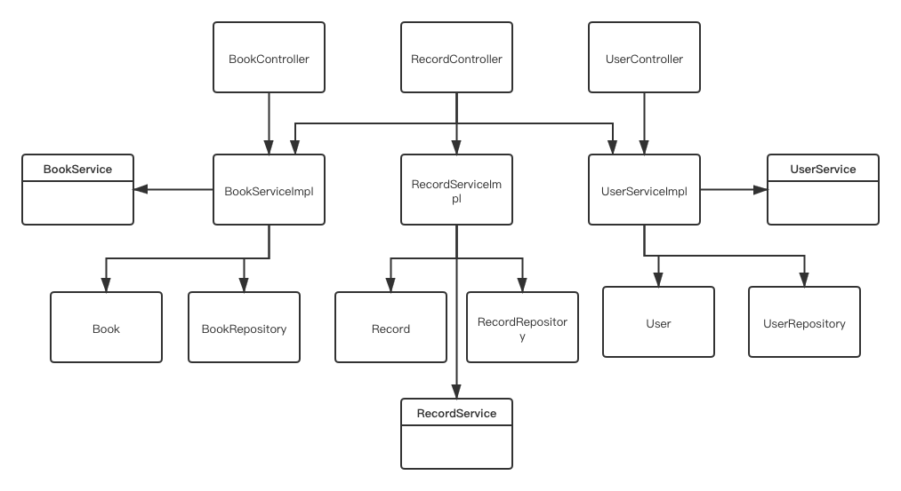

# Library Management System 

## Background
This library management system includes book management, user management and record management. It also use log4j2 framework to log all the request and response messages. All the data will be stored in the database by using JPA API and for db connection configuration, you can change the application.properties. The schema.sql is the schema I use in this unit test. You can customize on your own case.


## Develop Environment
- JDK8
- Maven 3.3.9
- Mysql 5.7


## Code Structure

source tree
```
└── lms
    ├── LMSApplication.java
    ├── controllers
    │   ├── BookController.java
    │   ├── RecordController.java
    │   └── UserController.java
    ├── entity
    │   ├── Book.java
    │   ├── Record.java
    │   └── User.java
    ├── repository
    │   ├── BookRepository.java
    │   ├── RecordRepository.java
    │   └── UserRepository.java
    ├── result
    │   ├── Result.java
    │   ├── ResultCode.java
    │   └── ResultFactory.java
    ├── service
    │   ├── BookService.java
    │   ├── BookServiceImpl.java
    │   ├── RecordService.java
    │   ├── RecordServiceImpl.java
    │   ├── UserService.java
    │   └── UserServiceImpl.java
    └── utils
        └── StringUtils.java
```

UML Class



## Limitations & Future Work
Currently this repo use JPA and later I will create a new branch to use mybaits to operate database; Also I need to focus on the performance to do some improvement.


## Usages
You can start to try by running 
- `mvn clean test` to run all the unit testing cases
- `mvn spring-boot:run` to start the spring boot application
- use postman to try below restful api and need to choose `application/json` for content type.

API Summary:
```
Book
GET  /api/books
POST /api/addBook
POST /api/updateBook/{id}
POST /api/deleteBook/{id}
GET  /api/book/searchByName/{name}
GET  /api/book/searchByISBN/{isbn}

Record
GET  /api/records
POST /api/borrow/{userId}/{bookId}
POST /api/return/{userId}/{bookId}

User
GET  /api/users
POST /api/addUser
```

Example:
```
POST
localhost:8080/api/addBook
{
	"id": 1,
	"isbn": "abcdefg",
	"bookName": "good",
	"author": "master",
	"publishDate": "20201024",
	"summary": "cool",
	"available": 1
}

POST
localhost:8080/api/addUser
{
	"id": 123456,
	"userName": "test",
	"count": 5
}

POST
localhost:8080/api/borrow/123456/1

POST
localhost:8080/api/return/123456/1
``` 


